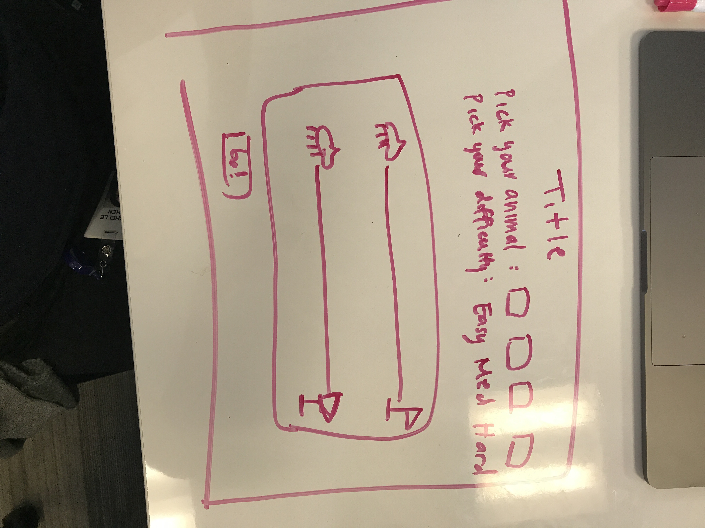

# Unit1Project

## Link to my project:
https://michen1031.github.io/Unit1Project/index.html

### Game I chose:
Get to the Apple first! (a made-up click event game)

### Rules:
After selecting a player and a difficulty, press start game and click run as many times as you can to beat the horse to the apple!

### Future features:
Creating a multi-player option
Changing the CSS to look more like a game app

### Any bugs:
When the user pauses the game and the game ends, sometimes the picture of the winner will infinite loop. Not sure why this is happening : ( 

### Technologies used:
HTML, CSS, JS, JQuery

### Your process/approach:
I made a basic layout of the game at first, and then worked on the javascript. At first, I only had one default player, but eventually I added more players for the user to choose from. I slowly added more features such as difficulty level, a countdown, and a best scores table, as well as created a more functional and aesthetic layout.

### Your biggest wins and challenges:
A large challenge for me was to make my code dry. I didn't have time at the end to dry parts of it up because I added a new future (different levels of best scores) on the last day.
A win was having a game that was able to work : ) as well as finishing the bulk of my project relatively early and adding features day by day in a stress-free manner.

### Your process for turning that game into a web application (wireframes, blockers/issues that popped up):
All my issues were self-given since I didn't use an API or outside code. When I had bugs I couldn't figure out, I went to the instructors for clarification and help.

### Wireframe:

### Trello link:
https://trello.com/b/ukf4YZjg/project1
